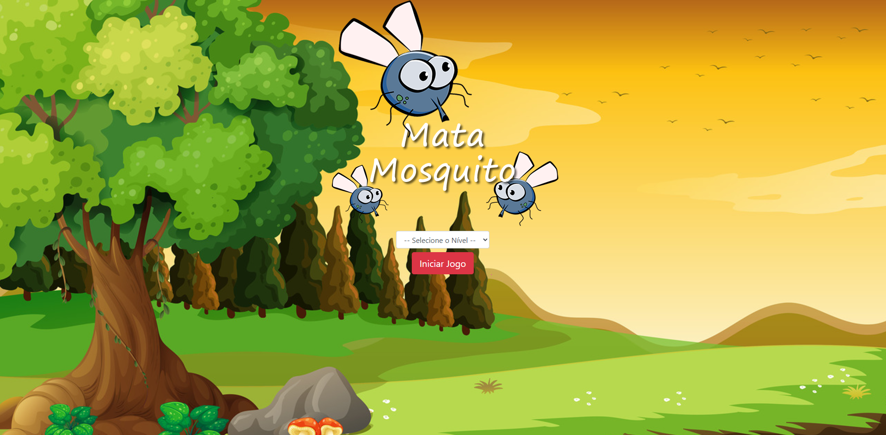

# 🎮 Jogo Mata-Mosquito

Aplicação web interativa desenvolvida para praticar **lógica de programação, manipulação do DOM e interação com o usuário** utilizando HTML5, CSS3 e JavaScript.

## 🖥️ Preview

## 🎯 Principais funcionalidades

* Seleção de nível de dificuldade:

  * Normal
  * Difícil
  * Chuck Norris
* Início da partida através do botão **Iniciar Jogo**
* Partida com duração de **20 segundos**
* Geração de mosquitos em diferentes posições da tela
* Tamanhos diferentes para os mosquitos
* Variação do lado de orientação dos mosquitos
* Sistema de vidas
* Perda de vida quando o mosquito desaparece antes de ser eliminado
* Tela de vitória ao finalizar o tempo da partida
* Tela de derrota quando todas as vidas são perdidas
* Opção de reiniciar o jogo após vitória ou derrota

## 🧠 Conceitos praticados

Durante o desenvolvimento do projeto foram praticados conceitos importantes de JavaScript, como:

* Manipulação do DOM
* Criação e remoção dinâmica de elementos HTML
* Eventos de clique
* Manipulação de atributos e propriedades dos elementos
* Alteração dinâmica de imagens
* Manipulação de classes CSS através do JavaScript
* Controle de tempo com `setInterval()` e `clearInterval()`
* Geração de valores aleatórios com `Math.random()`
* Estruturas condicionais `if/else`
* Estrutura de seleção `switch`
* Leitura de parâmetros da URL com `window.location.search`
* Controle de vidas
* Redirecionamento entre páginas com `window.location.href`

## 🛠️ Tecnologias utilizadas

* HTML5
* CSS3
* JavaScript

## 🌐 Demonstração

👉 [🎮 Jogar Mata-Mosquito](https://jonatasdassantos.github.io/app_mata_mosquito/)

## 📌 Sobre o projeto

O Jogo Mata-Mosquito foi desenvolvido como um projeto prático para aplicar conceitos de **desenvolvimento front-end e lógica de programação**.

A aplicação utiliza JavaScript para controlar a dinâmica da partida, incluindo a criação dos mosquitos, posicionamento aleatório, controle do tempo, gerenciamento das vidas e definição das condições de vitória ou derrota.

Os diferentes níveis de dificuldade alteram a velocidade de criação dos mosquitos, proporcionando diferentes níveis de desafio ao jogador.

## 🎯 Objetivo

Consolidar conhecimentos de **HTML5, CSS3 e JavaScript** através da criação de uma aplicação web interativa, colocando em prática conceitos de lógica de programação, manipulação do DOM e interação com o usuário.

## 👨‍💻 Autor

**Jonatas da Silva Santos**

[GitHub](https://github.com/jonatasdassantos) | [LinkedIn](https://www.linkedin.com/in/jonatas-da-silva-santos-33653b224/)
